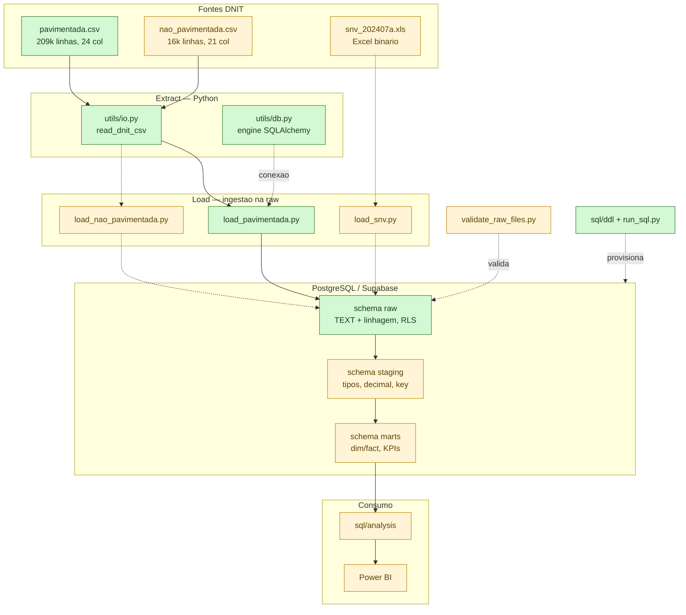

# 07 — Arquitetura e Fluxo de Engenharia de Dados

> Como o dado viaja da fonte do DNIT até a camada analítica, e o papel de cada
> arquivo de código nesse caminho. Documento de referência técnica da Fase 1.

## 1. Visão geral

O projeto segue uma **arquitetura em camadas** (estilo *medallion*):

```
raw  →  staging  →  marts
```

- **raw** — os dados exatamente como vieram da fonte (sem correção).
- **staging** — dados padronizados: tipos corrigidos, nomes consistentes, regras
  de qualidade aplicadas.
- **marts** — tabelas analíticas (dimensões, fatos e agregações) prontas para BI.

A abordagem é **ELT** (Extract → Load → Transform), não ETL:

1. **Extract** — ler o arquivo da fonte de forma fiel (Python).
2. **Load** — carregar o dado **cru** na camada `raw` do banco.
3. **Transform** — transformar **dentro do banco**, com SQL versionável.

**Por que ELT aqui?** Carregar primeiro o cru e transformar depois (a) preserva a
fonte para auditoria/reprocessamento, (b) deixa a transformação em SQL legível e
versionado (futuro `dbt`/`sql/`), e (c) é a prática dominante em Analytics
Engineering com bancos colunares/analíticos. O princípio operacional é:
**a camada raw nunca corrige valores** — quem corrige é o staging.

## 2. Diagrama do fluxo



> No diagrama: **verde** = implementado e rodando · **amarelo** = próximo passo (stub/pendente).

> ✅ = implementado e rodando · ⏳ = próximo passo (stub/pendente)

## 3. Mapa: código → função no fluxo

| Arquivo | Etapa | O que faz | Decisão de engenharia embutida |
|---|---|---|---|
| `tasks.ps1` | Orquestração | Atalhos `Setup`, `DbInit`, `Rls`, `IngestPavimentada`, `Sample` | Runner nativo do Windows (sem depender de `make`); um comando = uma etapa reproduzível |
| `pipelines/utils/db.py` | Conexão | Cria a engine SQLAlchemy a partir do `.env` | `URL.create` faz encoding automático da senha (caracteres `@`/`*` funcionam sem escaping manual) |
| `pipelines/utils/io.py` | **Extract** | `read_dnit_csv` (leitura fiel) + `normalize_column` | `sep=';'`, `encoding='utf-8-sig'` (BOM), `dtype=str`, `keep_default_na=False`, `quotechar='"'` — lê **sem alterar** os valores; só normaliza nomes de coluna |
| `pipelines/utils/run_sql.py` | Provisionamento | Executa arquivos `.sql` (DDL) no banco | Permite versionar a estrutura do banco como código (DDL idempotente) |
| `pipelines/ingest/load_pavimentada.py` | **Load** | Carrega o CSV pavimentada em `raw.raw_dnit_pavimentada` | Metadados de linhagem (`source_file`/`ingested_at`/`batch_id`); `TRUNCATE` → idempotente; `chunksize=1.000` respeita o teto de 65.535 parâmetros/statement do Postgres |
| `pipelines/ingest/load_nao_pavimentada.py` | Load (⏳) | Stub: carga da malha não pavimentada | Schema diferente (21 col) — documentado para implementação manual |
| `pipelines/ingest/load_snv.py` | Load (⏳) | Stub: carga do SNV `.xls` | `.xls` exige `xlrd`; schema a descobrir antes de modelar |
| `pipelines/quality/validate_raw_files.py` | Qualidade (⏳) | Stub: checagens da camada raw | Regras de `04_quality_rules.md` (UF, km, nulos `ND`, duplicidade) |
| `sql/ddl/00_create_schemas.sql` | Estrutura | Cria `raw`/`staging`/`marts` | Separação por camada desde o início |
| `sql/ddl/01_raw_tables.sql` | Estrutura | Cria as 3 tabelas raw | **Todas as colunas TEXT** — a raw não converte tipos; preserva a fonte |
| `sql/ddl/02_enable_rls.sql` | Segurança | Habilita RLS nas tabelas raw | Bloqueia anon/authenticated; conexão direta (`postgres`) ignora RLS e a ingestão segue |

## 4. Passo a passo do fluxo atual (E-L-T)

1. **Extract** — `io.read_dnit_csv()` abre o CSV tratando as armadilhas do arquivo
   (delimitador `;`, BOM, aspas escapadas) e devolve tudo como **texto**, com os
   nomes de coluna já em `snake_case`.
2. **Load** — `load_pavimentada.py` adiciona os metadados de linhagem, faz
   `TRUNCATE` (para a re-execução não duplicar) e grava em
   `raw.raw_dnit_pavimentada` em lotes. **Nenhum valor é corrigido** aqui — por
   isso `icm='51,25'` (vírgula) e `icm_unificado='51.25'` (ponto) convivem na raw.
3. **Transform** *(a implementar)* — o staging vai: converter vírgula→ponto e
   fazer `cast` numérico, mapear `'ND'`→`NULL`, padronizar UF/rodovia, tratar
   `km_inicial>km_final` (artefato de sentido) e criar a `segment_key`.

**O que já roda:** Extract + Load da malha **pavimentada** (209.204 linhas em
`raw`). **O que falta:** cargas da não pavimentada e do SNV, validações de
qualidade, e as camadas staging → marts → KPIs.

## 5. Decisões de engenharia e o porquê

Resumo (detalhe e datas em [`06_decision_log.md`](06_decision_log.md)):

- **Raw como texto, sem corrigir** — auditabilidade e reprocessamento; correção é
  responsabilidade do staging.
- **Decimal misto** (`,` vs `.` na mesma linha) — preservado na raw; convertido no
  staging. Ver [`04_quality_rules.md`](04_quality_rules.md).
- **BOM** — lido com `utf-8-sig` para não sujar o nome da 1ª coluna.
- **`km_inicial > km_final`** — artefato direcional (sentido `C`/`D`); decisão de
  tratamento adiada para o staging.
- **Idempotência** — `TRUNCATE` antes do load e DDL `IF NOT EXISTS`/`DROP ... IF
  EXISTS`: rodar de novo não quebra nem duplica.
- **`chunksize=1.000`** — abaixo do limite de 65.535 parâmetros por `INSERT` do
  Postgres (27 colunas × linhas).
- **Supabase + Session pooler (5432)** — Postgres gerenciado; a Transaction pooler
  (6543) quebraria prepared statements do psycopg3.
- **RLS habilitado** — fecha o acesso público às tabelas raw sem afetar a ingestão.

## 6. Estado atual vs próximos passos

| Item | Status |
|---|---|
| Ambiente, conexão, DDL, RLS | ✅ |
| Extract + Load — malha pavimentada (raw) | ✅ 209.204 linhas |
| Load — não pavimentada e SNV (`.xls`) | ⏳ stub |
| Validações de qualidade (raw) | ⏳ stub |
| Profiling manual | ⏳ scaffold em `notebooks/` |
| Staging (tipos, decimal, `segment_key`) | ⏳ |
| Marts + KPIs (`sql/analysis/`, dbt) | ⏳ |

Alinhado à seção `[Não lançado]` do [`CHANGELOG.md`](../CHANGELOG.md).

## 7. Glossário rápido

- **raw / staging / mart** — camadas: cru → padronizado → analítico.
- **ELT vs ETL** — aqui carrega-se o cru e transforma-se **dentro do banco** (ELT),
  em vez de transformar antes de carregar (ETL).
- **Linhagem (lineage)** — colunas `source_file`/`ingested_at`/`batch_id` que
  dizem de onde e quando cada linha veio.
- **Idempotência** — rodar a mesma etapa N vezes produz o mesmo resultado (sem
  duplicar dados).
- **`segment_key`** — chave de trecho a ser definida no staging (ver
  [`03_data_dictionary.md`](03_data_dictionary.md)).
